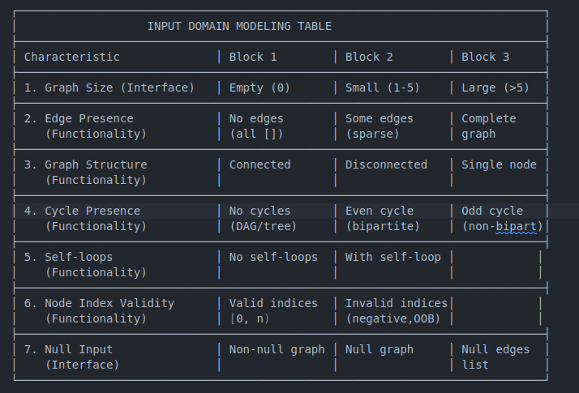
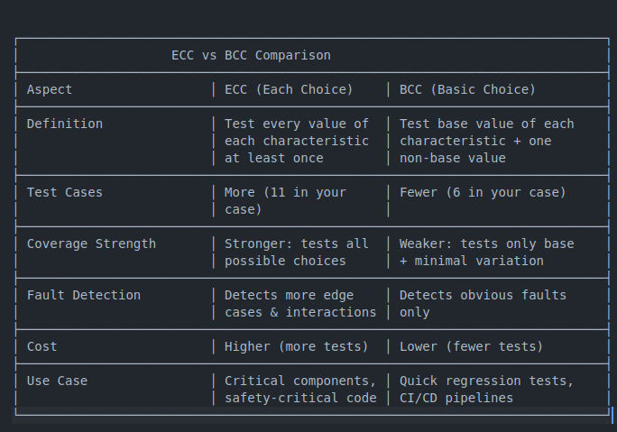

# 1) Acceptance Criteria

# Acceptance Criteria for isBipartite(int[][] graph)

## Valid Inputs
1. **Empty graph**: `graph = []` → return `true` (vacuously bipartite)
2. **Single node, no edges**: `graph = [[]]` → return `true`
3. **Two nodes, one edge**: `graph = [[1], [0]]` → return `true`
4. **Bipartite graph (even cycle)**: `graph = [[1,3], [0,2], [1,3], [0,2]]` (4-node cycle) → return `true`
5. **Non-bipartite graph (odd cycle)**: `graph = [[1,2], [0,2], [0,1]]` (3-node triangle) → return `false`
6. **Disconnected bipartite**: Multiple connected components, all bipartite → return `true`
7. **Disconnected non-bipartite**: At least one component is not bipartite → return `false`
8. **Self-loop**: `graph = [[0]]` (node 0 connected to itself) → return `false`
9. **Complete bipartite graph**: K_{m,n} where all nodes in set A connect to all in set B → return `true`
10. **Large graph**: 1000+ nodes → return correct result

## Invalid Inputs
1. **Null graph**: `graph = null` → throw `NullPointerException`
2. **Null adjacency list**: `graph = [[1], null, [0]]` → throw `NullPointerException`
3. **Invalid node index**: `graph = [[5], [0]]` where node 5 doesn't exist → throw `IndexOutOfBoundsException`
4. **Negative node index**: `graph = [[-1], [0]]` → throw `IllegalArgumentException`
5. **Duplicate edges**: `graph = [[1,1], [0,0]]` → should handle gracefully (may be treated as single edge)

## Exception Types
- `NullPointerException`: null input or null adjacency lists
- `IndexOutOfBoundsException`: node indices out of valid range [0, graph.length)
- `IllegalArgumentException`: negative or invalid node indices

# 2) Input Domain Modeling (IDM) Table
Program Characteristics & Block Values

#  Each Choice Coverage (ECC) Comprehensive (test all possibilities)

   
ECC Test Cases Details

// ECC-01: Empty graph
int[][] graph01 = {};
// Expected: true

// ECC-02: Single node
int[][] graph02 = {{}};
// Expected: true

// ECC-03: Tree (bipartite)
int[][] graph03 = {{1}, {0, 2}, {1}};
// Expected: true

// ECC-04: Even cycle (4-node square)
int[][] graph04 = {{1, 3}, {0, 2}, {1, 3}, {0, 2}};
// Expected: true

// ECC-05: Odd cycle (3-node triangle)
int[][] graph05 = {{1, 2}, {0, 2}, {0, 1}};
// Expected: false

// ECC-06: Disconnected bipartite
int[][] graph06 = {{1}, {0}, {3}, {2}};
// Expected: true

// ECC-07: Large bipartite (complete bipartite K_{10,10})
int[][] graph07 = generateCompleteBipartite(10, 10);
// Expected: true

// ECC-08: Self-loop
int[][] graph08 = {{0}};
// Expected: false

// ECC-09: Invalid node index
int[][] graph09 = {{5}, {0}};
// Expected: IndexOutOfBoundsException

// ECC-10: Null graph
int[][] graph10 = null;
// Expected: NullPointerException

// ECC-11: Null adjacency list
int[][] graph11 = {{1}, null, {0}};
// Expected: NullPointerException

# Basic Choice Coverage (BCC) Concise (test essentials only)

BCC Test Cases Details

// BCC-01: Empty graph
int[][] graphBCC01 = {};

// BCC-02: Even cycle (bipartite)
int[][] graphBCC02 = {{1, 3}, {0, 2}, {1, 3}, {0, 2}};

// BCC-03: Odd cycle (non-bipartite)
int[][] graphBCC03 = {{1, 2}, {0, 2}, {0, 1}};

// BCC-04: Self-loop
int[][] graphBCC04 = {{0}};

// BCC-05: Invalid index
int[][] graphBCC05 = {{10}, {0}};

// BCC-06: Null graph
int[][] graphBCC06 = null;